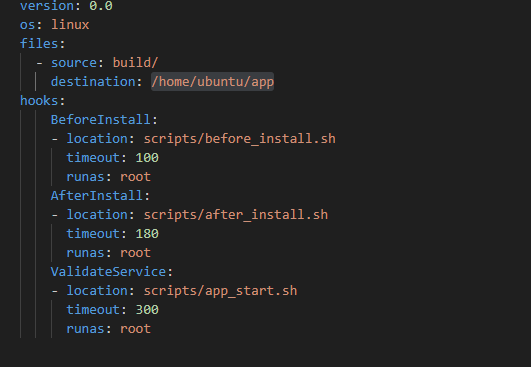
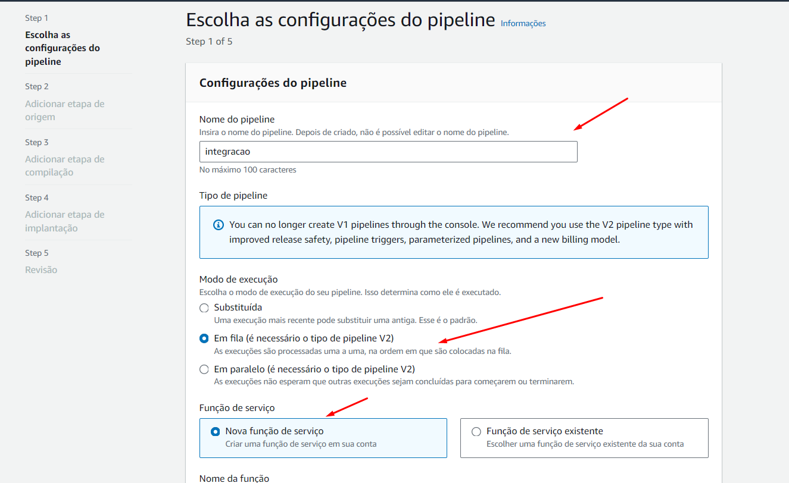
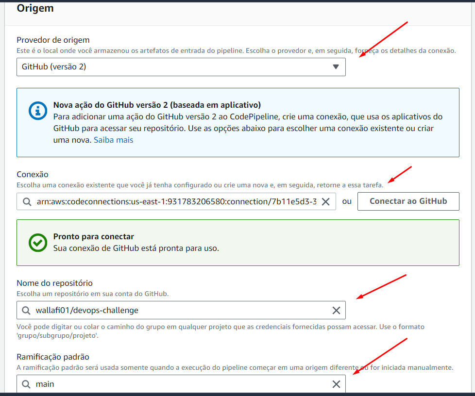
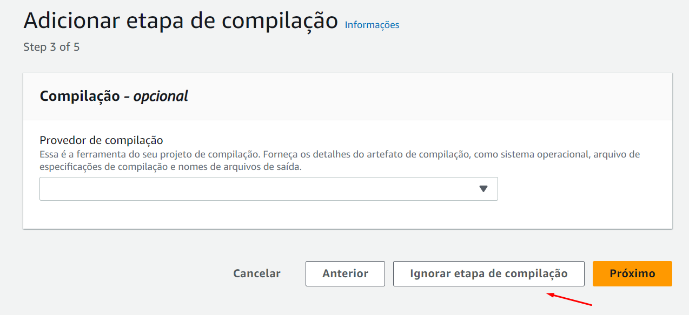

# DevOps Challenge

## Descrição

O processo de automação CI/CD na AWS EC2, através de uma pipeline integrada com GitHub Actions, será composto pelo AWS CodePipeline e AWS CodeDeploy. Esse processo será iniciado automaticamente após commits e push no repositório GitHub.

GitHub Actions será configurado para disparar automaticamente em push para o branch principal, acionando o início do pipeline. O AWS CodePipeline integrará o repositório GitHub com o AWS CodeDeploy, coordenando todo o fluxo de entrega contínua.

A infraestrutura será criada pelo Terraform e o AWS CodeDeploy será responsável por automatizar o deployment na instância EC2, garantindo a eficiência e a confiabilidade no processo de atualização contínua da aplicação. Com essa configuração, o processo de deployment se torna mais ágil e seguro, minimizando riscos e reduzindo o tempo de inatividade.

### Tecnologias Utilizadas
 
- Github
- GitHub Actions
- Terraform
- CodeDeploy
- CodePipeline
- Ansible

## Diagrama da Solução

  

## Instruções

## 1 - Configurações iniciais

**1.** Para começar, é essencial ter acesso à plataforma AWS para gerenciar seus recursos na nuvem de forma eficiente.

**2.** Crie um usuário na AWS e gere "Secret Keys" para acesso seguro aos recursos AWS via linha de comando. É recomendado não compartilhar essas "Secret Keys" para manter a segurança dos seus dados.

    - Selecione as políticas apropriadas, como AmazonEC2FullAccess, AmazonVPCFullAccess, AmazonCodeDeployFullAccess ou crie uma política personalizada com as permissões necessárias para seu projeto.

**3.** Criar um Bucket que servirá como um backend e armazenara o arquivo terraform.state gerado
  

**4. Configurar as variaveis para o Deploy na infraestrutra no arquivo ./src/variables.tf**

  

  - Observação : Por questões de segurança e recomendado criar a chave .pem na qual será para o acesso a EC2 ,diretamente na console e adicionar o nome da chave no campo variable "key_pair".

**5. Configurar as variaveis e Secrets para o funcionamento da Pipeline no arquivo ./github/workflows/main.yaml**  

**Etapa 1 - Deploy da Infraestrtura com Trerraform**

    - Objetivo desta etapa e a implantação de uma Infra AWS ,contendo EC2 , S3 , VPC e CodeDeploy.

   
  

 - No repositorio > Settings > Security (Secrets and variabels) > actions > Secrets : Repository Secrets > New Repository Secrets , adicionar todas as secrets selecionadas.

 - **AWS_ACCESS_KEY_ID  / AWS_SECRET_ACCESS_KEY**  - Chaves programaticas geradas na console na etapa incial.
 - **AWS_BUCKET_NAME** - Nome do bucket criado na console , para gerenciar o estado do terraform.
 - **AWS_BUCKET_FILE** - Nome do arquivo gerado pelo terraform (ex: terraform.tfstate).
 
**Etapa 2 - Informações da EC2:**

    - Objetivo desta etapa e obter as informações da ec2 como o IP público para o ansible acessa-lá.

     

  - No repositorio > Settings > Security (Secrets and variabels) > actions > variables >  Repository variables > New Reposiroty Secrets , adicionar a variavel abaixo .

 - **NAME_EC2** - Deverá conter o mesmo nome da instancia , implantada pelo terraform conforme abaixo no arquivo ./src/variables.tf.

      

**Etapa 3 - Provisionamento com Ansible:**

    - Objetivo desta etapa e instalar o Agent do Code Deploy na ec2.

  

 - **SSH_PRIVATE_KEY**  - Adicionar o conteudo da chave ".pem" criada na console para o ansible conseguir acessar o servidor.

**Etapa 4 - Deploy com CodeDeploy:**

    - Nesta etapa o CodeDeploy irá realizar a implantação na EC2.

    

 - **AWS_BUCKET_DEPLOY_NAME**  - Adicionar na Secrets , o nome do bucket que irá receber os Artiacts do CodeDeploy , o nome deverá ser o mesmo que foi definido no terraform .
 - **NAME_APP / NAME_GROUP** - Adicionar como variaveis , o o nome deverá ser o mesmo que foi definido no terraform conforme abaixo:

  

- **SOURCE_PATH: ./deploy** - Adicionar o path que contenha o appspec.yml e os scripts.

  

**5. Configurando appsec.yml**

  - Nesta etapa o CodeDeploy irá realizar a implantação na EC2.

  
  - O arquivo appspec.yml , localizado ./deploy do repositorio informará ao CodeDeploy  os comandos que você deseja executar durante a implantação

    

  **Scripts:**

  Serão responsavel por inicializar servidor Nginx e implantar a aplicação

  Gerar um token do repositorio , e criar uma secrets no repositorio com nome "token_git" e adicionaro token

     

**Etapa 6 - Criação CodePipeline:**

    - Nesta etapa o iremos criar o CodePipeline , para realizar a integração do Repositorio juntamente ao CodeDeploy.
    - Observação: A criação da ferramenta será via console , poís será preciso realizar autenticação juntamente ao GitHub.

  ir em Code Pipeline > criar Pipeline.

  

  Adicionar repositorio , precisara autenticar ao github  .

  

  No acionador manter essas configurações.

  

  Ignorar etapa de compilação.

  

  Etapa de implantação , selecionar o CodeDeploy como provedor , Nome do aplicativo eo Grupo de implantação.

  

  Proximo , revisar e criar pipeline  .

## 2 - Executando a Pipeline

**1. Primeiramente garantir se todas as etapas de configuração acima foram executadas**

**2. Preparar o diisparo do GitHub Actions (Trigger)**

- GitHub Actions é configurado para monitorar o repositório em busca de alterações no branch principal(main).
- Descomentar o bloco abaixo que esta presente em .github/workflows/main.yaml e salvar.

**3. Realizar um Push no repositorio**
- Ao realizar alguma alteração a Pipeline será disparada ,executando etapa por etapa conforme esta no arquivo main.yml

>  This is a challenge by [Coodesh](https://coodesh.com/)

